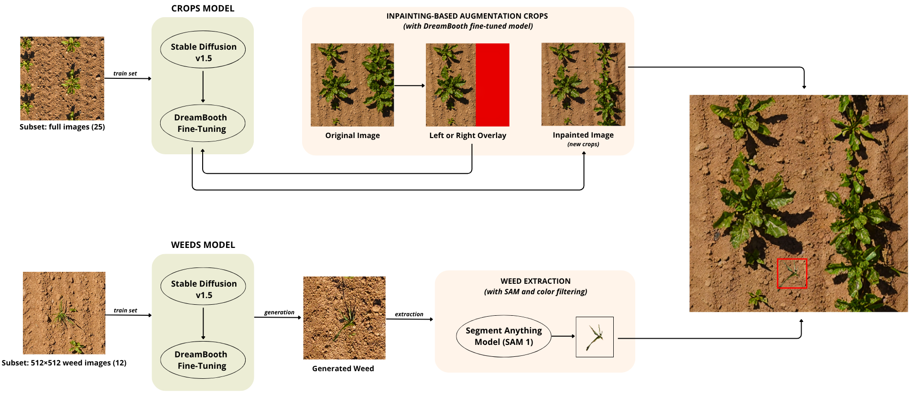

🌿 **DreamAug: DreamBooth-based Augmentation for Crops and Weeds Segmentation**

DreamAug is a synthetic data augmentation framework for semantic segmentation in precision agriculture. It leverages class-specific DreamBooth fine-tuning and mask-aware augmentation to enrich crop and weed datasets with high-fidelity, controllable samples, reducing annotation effort and improving model performance in low-data regimes.

🧩 **Overview**


DreamAug consists of two main branches:
- Crop Augmentation: Inpainting of masked regions in real images using a DreamBooth-tuned diffusion model trained on full field scenes.
- Weed Augmentation: Generation of individual synthetic weeds via a second DreamBooth model, segmentation with SAM, and controlled insertion into background regions of real images.

Each generated image is paired with a corresponding semantic mask, making the data ready-to-use for supervised segmentation training.

🛠 **Installation**

Before installing dependencies, we recommend creating a clean virtual environment using conda to avoid package conflicts:
```bash
conda create -n dreamaug python=3.10 -y
conda activate dreamaug
```

Then, clone the Hugging Face Diffusers repository and install the required libraries:
```bash
git clone https://github.com/huggingface/diffusers
cd diffusers/examples/dreambooth
pip install -r requirements.txt
```

Note: Ensure that your system has a CUDA-enabled GPU (≥12GB VRAM) and the appropriate PyTorch version installed. You can install GPU-enabled PyTorch following instructions from https://pytorch.org/get-started/locally.

DreamAug is built on top of the PhenoBench dataset, which provides high-resolution UAV images and pixel-level annotations for crop and weed segmentation.
You can download the dataset by visiting the official project page:

🔗 https://www.phenobench.org/dataset.html

🚀 **Usage**

To replicate the DreamAug pipeline and segmentation experiments, follow the steps below.

⚠️ Note: DreamBooth models trained are not included in this repository due to storage limitations. 

To train the crop-specific DreamBooth model, you can use pre-selected or custom sugar beet images from the PhenoBench dataset.

There are three ways to obtain suitable crop-only training images:
- Predefined set: use the ready-to-train image set available in `dreambooth/training/subset_crops`. These are the exact 25 images used in our experiments.
- Custom selection by clustering: use the notebook `dreambooth/training/utils/cluster.ipynb` to extract visually distinct images from the three acquisition dates (05-15, 05-26, 06-05).
- Weed-aware filtering: if you want to avoid weed contamination, you can filter scenes with low weed presence using `dreambooth/training/utils/count_weeds.ipynb`.

Once your image set is ready, launch the DreamBooth fine-tuning using the provided notebook: `dreambooth/training/dreambooth.ipynb`. This notebook performs subject-specific training and saves the resulting DreamBooth model locally under: `models/model_crops/`. You can use it to synthetically augment real field images by inpainting masked regions with realistic sugar beet plants.

To proceed:
- Select base images for inpainting: you can use the provided image list in `augmentation/images_to_modify/`, or manually choose a subset of real field images from the PhenoBench dataset.
- Launch the inpainting pipeline using the notebook: `dreambooth/augmentation/inpainting.ipynb`

Augmented images will be saved in `augmentation/inpainting_outputs/`.

The inpainting notebook updates the RGB image, but the semantic mask must also be updated so that the new synthetic crops are correctly labelled as class 1 (crop).  
Run dreambooth/augmentation/mask_reconstruction_crops.ipynb to automate this step. The updated masks are generated by combining the original semantic label map with the newly inpainted crop region.  
The resulting files are saved to `augmentation/combined_masks/`

To create synthetic weed instances, you need to fine-tune a second DreamBooth model specifically on weed imagery.

- Use the 12 annotated weed patches in `dreambooth/training/subset_weeds/`. These are the exact 512×512 crops used in our experiments.
- Fine-tune a new DreamBooth model using the notebook: `dreambooth/training/dreambooth.ipynb`, just as for crops.
  - Set the instance prompt to `"sks weed"`
  - Set the output directory to `models/model_weeds/`

Once the model_weeds has been trained, you can use it to synthesize standalone weed images:

- Run the generation notebook: `dreambooth/augmentation/weed_generation.ipynb`. This will produce 1024×1024 images, each containing one or more synthetic weed instances.
- Segment individual weed objects using SAM by running: `dreambooth/augmentation/weed_extraction.ipynb`. This step extracts clean RGBA cut-outs and their corresponding binary masks.

*SAM Requirement*: To use the Segment Anything Model (SAM), make sure to download the ViT-H checkpoint from the official Meta repository: save the file `sam_vit_h_4b8939.pth` into the `dreambooth/augmentation/` directory.

You can download it from:
🔗 https://github.com/facebookresearch/segment-anything#model-checkpoints

Once both synthetic crops and individual weed cut-outs have been prepared, the final step is to inject weeds into the previously augmented crop scenes.

To proceed run the notebook `dreambooth/augmentation/weed_injection.ipynb`. This script places weeds in valid background regions of the inpainted images, ensuring no overlap with crops or existing weeds. The associated segmentation masks are updated accordingly, assigning class 2 (weed) to the injected regions.

The final augmented dataset, containing both synthetic crops and weeds, will be saved as:
- Augmented RGB images: `augmentation/final_images/`
- Corresponding semantic masks: `augmentation/final_masks/`

Before training the segmentation models, we remap the semantic labels to align with the simplified class definitions used for evaluation. In the original PhenoBench annotations, the semantic mask labels include:
- 1 = Crop
- 2 = Weed
- 3 = PartialCrop
- 4 = PartialWeed

Since our segmentation task considers only three classes — background (0), crop (1), and weed (2) — we merge the partial classes as follows:
- 3 (PartialCrop) → 1 (Crop)
- 4 (PartialWeed) → 2 (Weed)

To perform this remapping, run the notebook `dreambooth/augmentation/remap_semantics.ipynb`.

🧠 **Semantic Segmentation**

To evaluate the impact of DreamAug on segmentation performance, we trained and tested three semantic segmentation models: ERFNet, DeepLabV3+, and UNet, using the official PhenoBench baselines.

⚠️ Note: ERFNet, DeepLabV3+, and UNet models are not included in this repository due to storage limitations. 

First, clone the PhenoBench baseline repository and set up the environment:
```bash
git clone https://github.com/PRBonn/phenobench-baselines
cd phenobench-baselines/semantic_segmentation
conda create -n phenobench_semseg python=3.8 -y
conda activate phenobench_semseg
pip install -r ./setup/requirements.txt
pip install torch==1.10.1+cu113 torchvision==0.11.2+cu113 torchaudio==0.10.1+cu113 -f https://download.pytorch.org/whl/cu113/torch_stable.html
pip install setuptools==59.5.0
```
⚠️ Note: The PyTorch installation may vary depending on your local CUDA version.

To reproduce our experiments, replace and configure the following components:
- Replace config folder: copy the custom `config/` directory from `dreamaug/classification/config/` into the cloned semantic_segmentation directory.
- Use the prepared datasets: place the `dataset_37` and `dataset_158` folders (included in `dreamaug/classification/`) into the root of the semantic_segmentation directory.
- Override baseline code: replace the original `module.py`, `pcd.py`, and `train.py` files with the modified versions provided in `dreamaug/classification/`.
- Set dataset paths: open each config YAML file inside `config/` and set the correct paths for your dataset folders (dataset_37 or dataset_158) under the data_root field.

You can now launch model training with the following commands:
```bash
# ERFNet
python train.py --config ./config/config_erfnet.yaml --export_dir <path-to-export-directory>

# DeepLabV3+
python train.py --config ./config/config_deeplab.yaml --export_dir <path-to-export-directory>

# UNet
python train.py --config ./config/config_unet.yaml --export_dir <path-to-export-directory>
```

After training, evaluate the trained models using:
```bash
# ERFNet
python test.py --config ./config/config_erfnet.yaml --ckpt_path <path-to-export-ckpt> --export_dir <path-to-results>

# DeepLabV3+
python test.py --config ./config/config_deeplab.yaml --ckpt_path <path-to-export-ckpt> --export_dir <path-to-results>

# UNet
python test.py --config ./config/config_unet.yaml --ckpt_path <path-to-export-ckpt> --export_dir <path-to-results>
```

Each test will output per-class IoUs and mIoU, which can be used to compare performance across baseline and DreamAug-augmented settings.