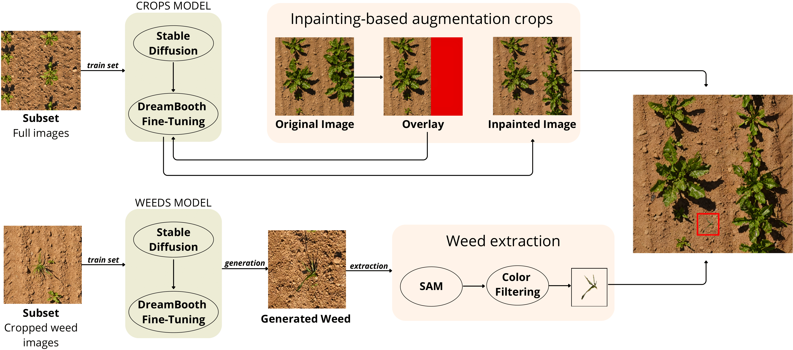

# 🌿 WeedDiffusion

**A Dual-Branch Synthetic Augmentation Framework for Weed Mapping**

WeedDiffusion is a synthetic data augmentation framework for semantic segmentation in precision agriculture. It leverages class-specific DreamBooth fine-tuning and mask-aware augmentation to enrich crop and weed datasets with high-fidelity, controllable samples, reducing annotation effort and improving model performance in low-data regimes.

## 🧩 Overview



WeedDiffusion consists of two main augmentation branches:

- **Crop Augmentation**: Inpainting of masked regions in real images using a DreamBooth-tuned diffusion model trained on full field scenes
- **Weed Augmentation**: Generation of individual synthetic weeds via a second DreamBooth model, segmentation with SAM, and controlled insertion into background regions of real images

Each generated image is paired with a corresponding semantic mask, making the data ready-to-use for supervised segmentation training.

## 🛠 Installation

WeedDiffusion uses [uv](https://github.com/astral-sh/uv) for fast, reliable Python package management. Everything is self-contained—no external repositories or manual dependency management required.

```bash
# Install uv (if not already installed)
curl -LsSf https://astral.sh/uv/install.sh | sh

# Clone the repository
git clone <repository-url>
cd weeddiffusion

# Create environment and install dependencies
uv sync
```

**Requirements**: CUDA-enabled GPU

## 📦 Dataset

WeedDiffusion is built on the PhenoBench dataset, which provides high-resolution UAV images and pixel-level annotations for crop and weed segmentation.

Download the dataset from the official project page:
🔗 https://www.phenobench.org/dataset.html

After downloading, your data directory should look like:
```
data/
├── PhenoBench/
│   ├── train/
│   │   ├── images/
│   │   └── semantics/
│   └── test/
└── PhenoBench_augmented/
    └── dreambooth_37/
        └── augmentation/
            ├── final_images/
            └── final_masks/
```

The `PhenoBench_augmented` directory contains pre-generated synthetic data. If you want to generate your own augmented data from scratch, you can skip downloading this and follow the generation steps below.

## 🚀 Quick Start

All operations are performed through the unified CLI interface in `main.py`.

### 1. Prepare Training Subsets

```bash
uv run python main.py make_subset
```

This extracts suitable crop and weed images from the PhenoBench dataset. The subset will be saved to `data/PhenoBench_subset/train/images_37/`.

**This step is required** even if you're using pre-generated augmented data, as the subset is used during segmentation training.

### Option A: Using Pre-generated Augmented Data

If you downloaded the pre-generated augmented images, skip to [Step 4: Train Segmentation Models](#4-train-segmentation-models).

### Option B: Generate Your Own Augmented Data

Follow steps 2-3 to create augmented data from scratch.

### 2. Train DreamBooth Models

Train the crop-specific model:
```bash
uv run python main.py train diffuser crop [--extra-args]
```

Train the weed-specific model:
```bash
uv run python main.py train diffuser weed [--extra-args]
```

### 3. Generate Synthetic Data

Generate augmented crops (inpainting + mask reconstruction):
```bash
uv run python main.py generate crop \
  --checkpoint <path-to-crop-model> \
  --root <output-directory> \
  --input_images data/PhenoBench_subset/train/images_37
```

Generate synthetic weeds:
```bash
uv run python main.py generate weed \
  --checkpoint <path-to-weed-model> \
  --root <output-directory> \
  --num_weeds 5
```

### 4. Train Segmentation Models

Train a semantic segmentation model (ERFNet, DeepLabV3+, or UNet):
```bash
uv run python main.py train segmentor \
  --config <path-to-config.yaml> \
  --export_dir <output-directory>
```

Optional flags:
- `--ckpt_path`: Resume from checkpoint
- `--resume`: Resume training from last checkpoint

### 5. Evaluate Models

Test a trained segmentation model:
```bash
uv run python main.py test \
  --config <path-to-config.yaml> \
  --ckpt_path <path-to-checkpoint> \
  --export_dir <results-directory>
```

### 6. Run Full Experiments

Train and test in one command:
```bash
uv run python main.py experiment \
  --config <path-to-config.yaml> \
  --export_dir <output-directory>
```

This automatically:
1. Trains the segmentation model
2. Identifies the best checkpoint
3. Evaluates on the test set
4. Saves results to the export directory

## 📊 Reproducing Paper Results

To reproduce all segmentation experiments from the paper, use the provided `scripts.sh`:

```bash
# Make the script executable
chmod +x scripts.sh

# Run all experiments
./scripts.sh
```

This will train and evaluate all model configurations:

**Baseline (37 training images)**:
- ERFNet: base, geo, color, geocolor variants
- DeepLabV3+: base, geo, color, geocolor variants
- UNet: base, geo, color, geocolor variants

**WeedDiffusion augmented (37 + synthetic)**:
- ERFNet: base, geocolor variants
- DeepLabV3+: base, geocolor variants
- UNet: base, geocolor variants

All results will be saved to `out/segmentation/` with separate subdirectories for each experiment.

## 📋 Configuration

Segmentation models are configured via YAML files in `semantic_segmentation/config/`. The framework supports multiple augmentation strategies:

- **base**: RGB images only
- **geo**: RGB + geometric augmentations (flip, scale, crop)
- **color**: RGB + color augmentations (brightness, contrast, saturation, hue)
- **geocolor**: RGB + geometric + color augmentations

### Key Configuration Parameters

```yaml
data:
  path_to_dataset: data/PhenoBench
  paths_to_train:
    - [data/PhenoBench_subset/train/images_37, data/PhenoBench/train/semantics]
    - [data/PhenoBench_augmented/dreambooth_37/augmentation/final_images, 
       data/PhenoBench_augmented/dreambooth_37/augmentation/final_masks]

backbone:
  name: deeplabv3plus_resnet50  # or erfnet, unet
  num_classes: 3

train:
  max_epoch: 200
  learning_rate: 5.0e-4
  batch_size: 4
  class_weights: [1.47, 5.06, 10.02]  # Background, Crop, Weed
  
  geometric_data_augmentations:
    random_hflip: null
    random_vflip: null
    random_scale: {min_scale: 1.0, max_scale: 1.1}
    random_crop: {height: 768, width: 768}
  
  color_data_augmentations:
    random_global_brightness: {min_brightness_factor: 0.6, max_brightness_factor: 1.4}
    random_global_contrast: {min_contrast_factor: 0.6, max_contrast_factor: 1.4}
    # ... additional augmentations
```

Update the `data.path_to_dataset` and `data.paths_to_train` fields to match your local dataset paths.

## 🎯 Semantic Classes

The framework uses three semantic classes:
- **0**: Background
- **1**: Crop (includes PartialCrop from original annotations)
- **2**: Weed (includes PartialWeed from original annotations)

Class weights are automatically computed to handle class imbalance in the training data.

## 📊 Evaluation Metrics

Models are evaluated using:
- **Per-class IoU** (Intersection over Union)
- **mIoU** (mean IoU across all classes)

Results are saved to the specified export directory:
```
<export_dir>/
├── train/
│   └── lightning_logs/
│       └── version_X/
│           ├── checkpoints/
│           └── metrics.csv
└── test/
    ├── predictions/
    ├── visualizations/
    └── results.json
```

## 🔧 Advanced Usage

### Custom Training Arguments

Pass additional arguments to DreamBooth training:
```bash
uv run python main.py train diffuser crop \
  --learning_rate=1e-6 \
  --max_train_steps=800
```

### Resume Training

Resume segmentation model training from a checkpoint:
```bash
uv run python main.py train segmentor \
  --config semantic_segmentation/config/images_37/config_erfnet_base.yaml \
  --export_dir ./experiments/run_01 \
  --ckpt_path ./checkpoints/last.ckpt \
  --resume
```

### Single Model Training

Train a specific model configuration:
```bash
uv run python main.py experiment \
  --config semantic_segmentation/config/weeddiff_37/config_deeplab_geocolor.yaml \
  --export_dir out/segmentation/custom_run
```

## 📝 Notes

- **DreamBooth models**: Not included due to storage limitations—train them using the provided commands or use pre-generated augmented data
- **SAM checkpoint**: Automatically handled by the pipeline (`sam_vit_h_4b8939.pth`)
- **Reproducibility**: Set `seed` in config files for deterministic results

## 🤝 Citation

If you use WeedDiffusion in your research, please cite the original work:

```bibtex
Coming soon
```

## 📄 License

This project is licensed under the MIT License. See the [LICENSE](LICENSE) file for details.